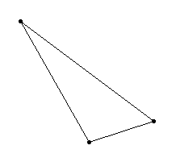
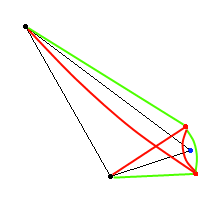

# RFA_demo

The recursive-fold-algorithm (RFA) is a recursive algorithm for the metric travelling-salesman-problem (TSP). The objective of the TSP is to find a
round trip through a number of cities/locations (more generally referred to as **nodes**). The round trip should be as short as possible. The TSP
is a very hard problem with difficult computational properties (TSP belongs to the NP-hard problem class).

Recursive algorithms naturally split a problem into a series of smaller steps that are easier to solve individually. As such, they're often
very elegant.

## Idea

RFA exploits the fact that the TSP can be trivially solved if there are only 3 nodes, because only a single round trip route exists
for 3 nodes. The solution is self-evident:



This **trivial case** is the **recursion anchor** for the algorithm.

But how to deal with larger problem sizes? The answer is to **fold
nodes**. Folding means that two nodes that are in close proximity to each other are fused into an artifical new node. This new node gets placed in the middle
between the two original nodes. By remembering the original nodes it is also possible to reverse such a folding operation later on (referred to as **unfolding**). Of course, folded nodes can be folded again themselves (recursively).

Once only 3 nodes remain, a preliminary solution (route) can be constructed. Again, this is self-evident:


The key to RFA is that the nodes are now unfolded step by step. Each unfolding
removes a node and replaces it with two new nodes. These new nodes can be inserted
into the preliminary route in two alternative orders only. In the following picture the artificial node in the bottom-right corner (blue) is unfolded:



It is obvious that the new nodes (red) can only be inserted in two different orders. It is also easy to determine which of these orders gives the shorter route (the green one).

The complete process can be described as follows:

- **Folding:** Pick a node and fold it with a neighboring node. Repeat folding nodes until the number of nodes has been reduced to 3.
- **Recursion anchor:** Create a preliminary round trip route through the 3 remaining nodes.
- **Unfolding:** Unfold the nodes until the original nodes have been restored. At each unfolding step, insert the new nodes in the preliminary route. Choose the insertion order that gives the shorter route length.

## Implementation details

This repository contains `RFABasic`, a naive / greedy implementation of the RFA:

- **Folding:** Nodes are picked in random order. Each node is folded with its nearest neighbor. This process is repeated until 3 nodes remain.
- **Unfolding:** The nodes in the preliminary route are unfolded sequentially (breadth-first approach). This process is repeated until all of the original nodes have been restored.

## Install

The scripts require

- Python 3.2 or above.
- optionally: the [tabulate] module (for pretty results in benchmark mode)

The easiest way is to use `pipenv`. A `Pipfile` is included in the project. You can simply download the code and run `pipenv install` in the top-level
project folder. Then switch to the project's Python environment by executing `pipenv shell`. You can now execute the main script `RFA_demo.py` as described
in the below *Usage* section.

## Usage

The main script is RFA_demo.py and it features multiple commandline arguments. There is only one obligatory argument, namely the mode, which may be `demo` or `benchmark`.

### 'demo' mode

The following command runs a simple demonstration based on 100 randomly generated nodes with a random number generator seed of 17:

```
$ python RFA_demo.py demo -n 100 -s 17
Total costs:    4398
Runtime:        0.013s
```

By default, the generated nodes and the resulting route will also be rendered on-screen (using Python's `turtle` module). This can be
switched off by adding the `--no-rendering` option.

### 'benchmark' mode

The following command runs a benchmark using a subset of the [TSPLIB] instances (a280, berlin52, bier127, ch150, eil51, pr76, pr107, pr439, pr1002, rat99, and rat783):

```
$ python RFA_demo.py benchmark -s 17 --no-rendering
...
Instance      Costs of optimal route    Costs of RFA route  Cost factor    Runtime
----------  ------------------------  --------------------  -------------  ---------
a280                            2579                  3364  130.44%        0.069s
berlin52                        7542                 10083  133.69%        0.004s
bier127                       118282                139393  117.85%        0.018s
ch150                           6528                  8040  123.16%        0.024s
eil51                            426                   461  108.22%        0.004s
pr76                          108159                126517  116.97%        0.007s
pr107                          44303                 46094  104.04%        0.013s
pr439                         107217                132399  123.49%        0.179s
pr1002                        259045                308964  119.27%        0.880s
rat99                           1211                  1493  123.29%        0.011s
rat783                          8806                 10164  115.42%        0.535s
```

### Remarks

- A random number generator seed is used even in benchmark mode, because the algorithm itself uses random numbers for calculating a route.
- The `--no-rendering` option disables the on-screen rendering of the calculated route. If you remove this option, you will be able to review
  the calculated route.

# License

You may download and execute the RFA_demo scripts.

[tabulate]:https://pypi.python.org/pypi/tabulate
[TSPLIB]:http://comopt.ifi.uni-heidelberg.de/software/TSPLIB95/
