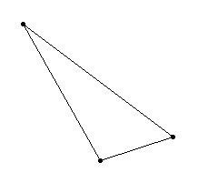
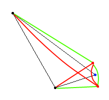

# RFA_demo <!-- omit from toc -->

The recursive-fold-algorithm (RFA) is a recursive algorithm for the metric travelling-salesman-problem (TSP). The objective of the TSP is to find a
round trip through a number of cities/locations (more generally referred to as **nodes**). The round trip should be as short as possible. The TSP
is a very hard problem with difficult computational properties (TSP belongs to the NP-hard problem class).

Recursive algorithms naturally split a problem into a series of smaller steps that are easier to solve individually. As such, they're often
very elegant.

## Contents <!-- omit from toc -->

- [Idea](#idea)
  - [Folding strategies](#folding-strategies)
  - [Unfolding strategies](#unfolding-strategies)
- [Install](#install)
- [Usage](#usage)
  - ['demo' mode](#demo-mode)
  - ['benchmark' mode](#benchmark-mode)
- [License](#license)

## Idea

RFA exploits the fact that the TSP can be trivially solved if there are only 3 nodes, because only a single round trip route exists
for 3 nodes. The solution is self-evident:

This **trivial case** is the **recursion anchor** for the algorithm.

But how to deal with larger problem sizes? The answer is to **fold
nodes**. Folding means that two nodes that are in close proximity to each other are fused into an artifical new node. This new node gets placed in the middle
between the two original nodes. By remembering the original nodes it is also possible to reverse such a folding operation later on (referred to as **unfolding**). Of course, folded nodes can be folded again themselves (recursively).

Once only 3 nodes remain, a preliminary solution (route) can be constructed. Again, this is self-evident:

The key to RFA is that the nodes are now unfolded step by step. Each unfolding
removes a node and replaces it with two new nodes. These new nodes can be inserted
into the preliminary route in two alternative orders only. In the following picture the artificial node in the bottom-right corner (blue) is unfolded:

It is obvious that the new nodes (red) can only be inserted in two different orders. It is also easy to determine which of these orders gives the shorter route (the green one).

The complete process can be described as follows:

- **Folding:** Pick a node and fold it with a neighboring node. Repeat folding nodes until the number of nodes has been reduced to 3.
- **Recursion anchor:** Create a preliminary round trip route through the 3 remaining nodes.
- **Unfolding:** Unfold the nodes until the original nodes have been restored. At each unfolding step, insert the new nodes in the preliminary route. Choose the insertion order that gives the shorter route length.

### Folding strategies

- `FoldingStrategyRandomWithNearestNeighbor`: A very simple yet highly efficient method which
  randomly picks a node and folds it with the nearest-neighbor.
- `FoldingStrategyOutsideIn`: The node furthest from the center point is folded with its nearest-neighbor. The center
  point is only calculated once at the beginning.

### Unfolding strategies

- `UnfoldingStrategyBreadthFirst`: The list of folded nodes is processed repeatedly. During each iteration, only
  the nodes with the maximum depth are unfolded.
- `UnfoldingStrategyBreadthFirstWithLocal2Opt`: Same as UnfoldingStrategyBreadthFirst, but after each unfolding
  step, a local 2-opt optimization around the inserted nodes is performed.

## Install

The scripts require

- Python 3, for example 3.13 is working.
- optionally: the [tabulate] module (for pretty results in benchmark mode)

The easiest way is to use `pipenv`. A `Pipfile` is included in the project. You can simply download the code and run `pipenv install` in the top-level
project folder. Then switch to the project's Python environment by executing `pipenv shell`. You can now execute the main script `RFA_demo.py` as described
in the below *Usage* section.

## Usage

The main script is RFA_demo.py and it features multiple commandline arguments. There is only one obligatory argument, namely the mode, which may be `demo` or `benchmark`.

### 'demo' mode

The following command runs a simple demonstration based on 100 randomly generated nodes with a random number generator seed of 17:

    $ python RFA_demo.py demo -n 100 -s 17
    Total costs:    4366
    Runtime:        0.003s

### 'benchmark' mode

The following command runs a benchmark using a subset of the [TSPLIB] instances:

    $ python RFA_demo.py benchmark -s 17
    ...
    Instance      Costs of optimal route    Costs of RFA route  Cost factor    Runtime
    ----------  ------------------------  --------------------  -------------  ---------
    a280                            2579                  3378  130.98%        0.019s
    berlin52                        7542                 10098  133.89%        0.001s
    bier127                       118282                145415  122.94%        0.004s
    ch150                           6528                  7521  115.21%        0.006s
    eil51                            426                   470  110.33%        0.001s
    pla7397                     23260728              29311298  126.01%        10.068s
    pr76                          108159                117739  108.86%        0.003s
    pr107                          44303                 45368  102.40%        0.003s
    pr439                         107217                135217  126.12%        0.046s
    pr1002                        259045                311410  120.21%        0.221s
    rat99                           1211                  1414  116.76%        0.004s
    rat783                          8806                 10283  116.77%        0.137s
    usa13509                    19982859              24624771  123.23%        39.387s

You will get much better results by enabling local 2-opt during the unfolding phase:

    $ python RFA_demo.py benchmark -s 17 --unfolding-strategy breadth-first-2opt
    ...
    Instance      Costs of optimal route    Costs of RFA route  Cost factor    Runtime
    ----------  ------------------------  --------------------  -------------  ---------
    a280                            2579                  2917  113.11%        0.057s
    berlin52                        7542                  8208  108.83%        0.008s
    bier127                       118282                129273  109.29%        0.022s
    ch150                           6528                  6947  106.42%        0.026s
    eil51                            426                   442  103.76%        0.006s
    pla7397                     23260728              26968779  115.94%        11.688s
    pr76                          108159                112468  103.98%        0.013s
    pr107                          44303                 44326  100.05%        0.017s
    pr439                         107217                122899  114.63%        0.111s
    pr1002                        259045                281735  108.76%        0.389s
    rat99                           1211                  1274  105.20%        0.015s
    rat783                          8806                  9814  111.45%        0.264s
    usa13509                    19982859              22460248  112.40%        42.294s

## License

You may download and execute the RFA_demo scripts.

[tabulate]:https://pypi.python.org/pypi/tabulate
[TSPLIB]:http://comopt.ifi.uni-heidelberg.de/software/TSPLIB95/
